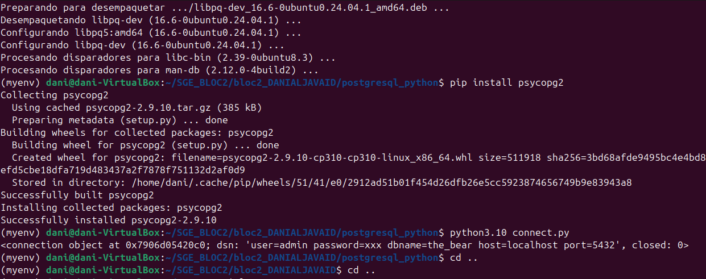

# SGE_BLOC2

El que es veu es que hem instal·lat el psycopg2 i despres hem importat el codi donat en els documents afegint-hi un print i acte seguit hem posat la següent comanda per veure si funciona amb el print.