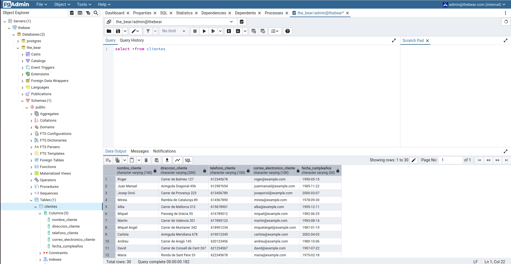

# SGE_BLOC2

El que es veu es una inserció de taules a pgadmin, ho he aconseguit mitjançant creant el segënts arxius **csv_to_dict** i **dict_to_db** en vscode. La funció csv_to_dict llegeix un arxiu CSV (**Clients.csv**) i ho converteix en un diccionari. En aquest diccionari, cada clau correspon a una columna del CSV i el valor és una llista amb tots els valors d'aquesta columna. 
Enviament a la base de dades: El primer arxiu passa les dades a la funció **send_data_to_db** del segon arxiu. Inserció en la base de dades: El segon arxiu es connecta a la base de dades i executa una consulta INSERT per a agregar els registres de cada client en la taula Clients. Cicle d'insercions: Aquest procés es repeteix 30 vegades (una vegada per cada client).